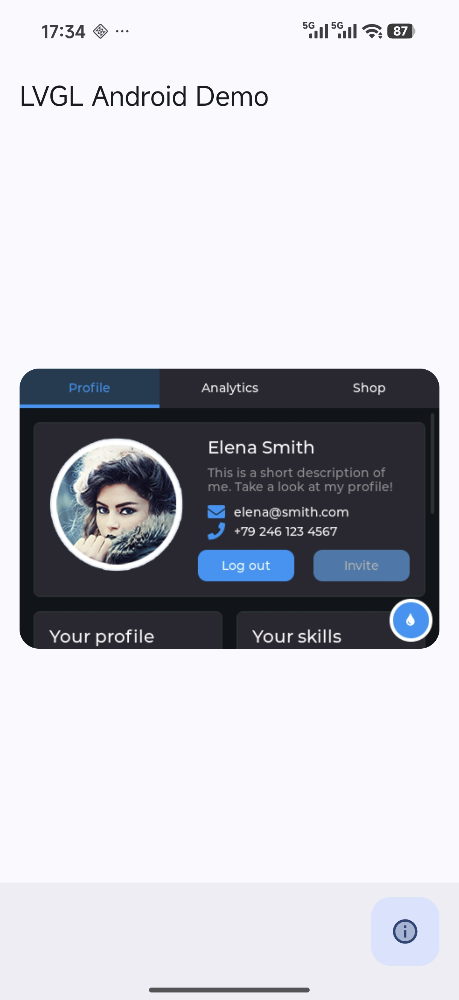

# LVGLAndroid


适用于 Android 的 LVGL 静态 Prefab 库.

此仓库基于官方 [LVGL](https://github.com/lvgl/lvgl) 仓库.

此仓库仅用来提供 [LVGL](https://github.com/lvgl/lvgl) 源码的 [Prefab](https://developer.android.com/build/native-dependencies?hl=zh-cn&agpversion=4.1&buildsystem=cmake) 静态库, 对于在Android上的渲染需要开发者自行实现, 当然此项目的 [demo](https://github.com/wyq0918dev/LVGLAndroid/tree/master/demo) 模块已经提供了一个简单的实现, 开发者可以参考此实现来实现自己的渲染逻辑.



---

## 如何使用

settings.gradle.kts
```kotlin
dependencyResolutionManagement {
    repositories {
        maven(url = "https://jitpack.io") // 此仓库使用Jitpack发布
    }
}
```
libs.versions.toml
```toml
[versions]
lvgl = "这里写最新版本"

[libraries]
lvgl-android = { group = "com.github.wyq0918dev", name = "LVGLAndroid", version.ref = "lvgl" }
```
build.gradle.kts
```kotlin
android {
    buildFeatures {
        prefab = true // 需要启用Prefab
    }
}

dependencies {
    implementation(libs.lvgl.android) // 依赖LVGL Prefab库
}
```
CMakeLists.txt
```cmake
# 查找LVGL库
find_package(lvgl REQUIRED CONFIG)
# 链接LVGL库
target_link_libraries(
        ${CMAKE_PROJECT_NAME}
        lvgl::lvgl # 主LVGL库
        lvgl::lvgl_demos # 官方Demo (可选)
        lvgl::lvgl_examples # 官方Example (可选)
)
```
main.cpp
```objectivec
#include <lvgl.h>
```